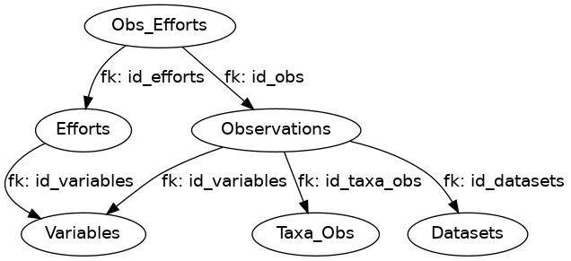

## Managing observations

Ecological observations are managed through a star schema, where the core table is `observations` and the dimension tables are `datasets`, `taxa`, `taxa_obs`, `variables` and `efforts`. The `observations` table contains the foreign keys to the dimension tables, as well as the observation value and the observation geometry. The dimension tables contain the metadata for the observations.

It is is designed to support different observation types, such as abundances, occurrences, and presence/absence data of various units.

<!-- caption -->
***Figure 1.** Entity relationship diagram for the observations related tables*

### Tables overview

Below is a brief description of each table. See the [Schema Reference section](public_observations.md) for more details on each table.

**[Observations](public_observations.md)**: Central to the schema, storing detailed records of individual ecological observations.

> **Important for injection**
>
> Geometry can be injected using the WKT format: `SRID=4326;POINT(-73.5 45.5)` and will be automatically converted to the PostGIS geometry type.
>
> Columns `created_at`, `created_by`, `modified_at`, `within_quebec`, `dwc_event_date` are automatically set by the database and should not be set manually.

**[Datasets](public_datasets.md)**: Manages metadata about different datasets to which observations belong. Includes comprehensive information like source, creator, title, and publisher.

**[Variables](public_variables.md)**: Categorizes different observation types and units.

**[Taxa_Obs](public_taxa_obs.md)**: Stores raw taxonomic information as provided by the source, facilitating the recording of various taxa. Those entries are meant as an archive of the original data and are not used for data retrieval. Taxonomic information is managed by other resources within the database, like the `taxa_ref` table. See the `managing_taxonomy` article for more details.

> **Important for injection**
> 
> The `scientific_name` column is required. The `authorship` and `rank` columns are optional and will be set to an empty string if not provided. Entries are accepted for any taxonomic rank, including species, genus, complexes, etc.
>
> The `parent_scientific_name` column is optional. It is used to resolve conflicts where a scientific name corresponds to different organisms in different branches of the tree of life. If not specified, all results for the given scientific name are returned. *It is recommended to specify the phylum or kingdom when available*
>
> Columns `rank`, `authorship` are optional and should only be set if available by the source. 

**[Efforts](public_efforts_obs_efforts.md)**: Quantifies the efforts (like time, distance, etc.) put into making an observation.

**[Obs_Efforts](public_efforts_obs_efforts.md)**: Links observations with their corresponding efforts. Creates a many-to-many relationship, allowing multiple efforts to be linked to a single observation and vice versa.

### Considerations

**Auto-generated columns**: The following columns are automatically generated by the database and should not be set manually: `created_at`, `created_by`, `modified_at`, `within_quebec`, `dwc_event_date`.

**Unique Constraints**: Unique constraints are used to prevent duplicate observations from being inserted into the database. The combination of `geom`, `dwc_event_date`, `id_taxa_obs`, `obs_value`, `id_variables`, `within_quebec` ensures that each observation is uniquely identifiable and retrievable. 

**Partitions**: Partitions are used to store observations that are within or outside of Quebec. This allows for faster queries on observations that are within Quebec, which are the most commonly used. See the `partitions` section in the [observations schema reference](public_observations.md) for more details.

**Taxonomic information**: Only raw taxonomic information is stored in the `taxa_obs` table. The valid taxonomy, references, and other information are managed by `taxa_ref`, `taxa_vernacular`, `taxa_groups` tables and related ressources. This is managged automatically with periodic updates. See the `managing_taxonomy` article for more details.